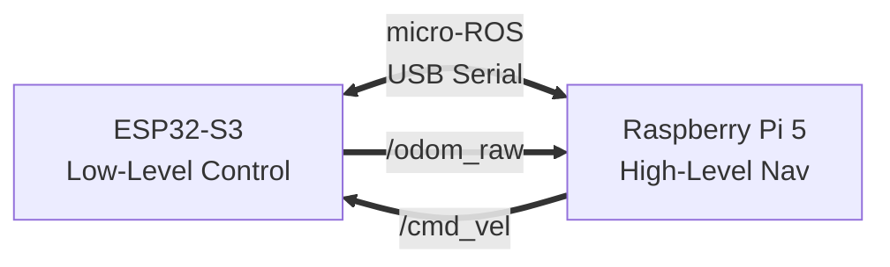

# AMR Platform: Autonomous Mobile Robot

**Ein hybrides AMR-System basierend auf ESP32-S3 (Real-Time Control) und Raspberry Pi 5 (High-Level Navigation).**

Dieses Repository enthält die Firmware, Treiber und Konfigurationen für einen Differential-Drive-Roboter, der für **SLAM** und **autonome Navigation (Nav2)** unter ROS 2 Humble entwickelt wurde.

-----

## 🏗 Architektur

Das System folgt einer **Hybrid-Echtzeit-Architektur**:

* **Low-Level (ESP32-S3):** Harte Echtzeit-Regelung der Motoren (100 Hz PID), Odometrie-Integration und Safety-Features. Implementiert als **Dual-Core FreeRTOS** Applikation.
* **High-Level (Raspberry Pi 5):** ROS 2 Navigation Stack, LiDAR-Verarbeitung, SLAM und KI-Inferenz (Hailo-8L).
* **Kommunikation:** micro-ROS (XRCE-DDS) über natives USB-CDC.

<!-- end list -->



👉 **[Technische Detail-Dokumentation lesen](https://www.google.com/search?q=docs/systemdokumentation.md)** *(Architektur, PID-Tuning, Pin-Belegung & Protokolle)*

-----

## 🚀 Quick Start

### 1\. Voraussetzungen

* **Host:** Raspberry Pi 5 mit Ubuntu 22.04 / ROS 2 Humble
* **Dev-PC:** VS Code mit PlatformIO Extension

### 2\. Firmware flashen (ESP32)

```bash
cd firmware
pio run -t upload
# Nach dem Upload blinkt die LED (sucht Agent)
```

### 3\. Agent & Bridge starten (Raspberry Pi)

Der Roboter benötigt den micro-ROS Agenten und den Odometrie-Konverter.

```bash
# 1. Agent starten (DDS Kommunikation)
sudo systemctl start microros-agent

# 2. Workspace sourcen & Bridge starten (Raw -> Standard ROS 2)
source ~/ros2_ws/install/setup.bash
ros2 run amr_pkg odom_converter.py
```

### 4\. Testfahrt

```bash
# Teleop starten
ros2 run teleop_twist_keyboard teleop_twist_keyboard
```

> **Safety Note:** Der Roboter stoppt automatisch, wenn 1000ms keine Befehle empfangen werden (Failsafe).

-----

## 🧩 Hardware Setup

| Komponente | Typ | Funktion |
| :--- | :--- | :--- |
| **MCU** | Seeed Studio XIAO ESP32-S3 | Motorregelung & Sensor-Interface |
| **Treiber** | Cytron MDD3A | Dual Channel Motor Driver (PWM) |
| **Motoren** | JGA25-370 (12V) | Encoder-Motoren (374 Ticks/Rev) |
| **Lidar** | RPLIDAR A1M8 | 2D Laser Scan (12m) |
| **Power** | 3S Li-Ion (12V) | Stromversorgung |

👉 **[Detaillierte Schaltpläne und Pinouts](https://www.google.com/search?q=docs/hardware_setup.md)** *(ToDo)*

-----

## 📂 Projektstruktur

```text
amr-platform/
├── firmware/                 # ESP32-S3 Source Code (PlatformIO)
│   ├── src/main.cpp          # Dual-Core Realtime App
│   └── include/config.h      # Hardware & PID Konfiguration
├── ros2_ws/                  # ROS 2 Workspace (Pi 5)
│   └── src/amr_pkg/          # Custom Packages (Bridge, Description)
├── docker/                   # Docker-Container (micro-ROS Agent)
└── docs/                     # Dokumentation & Logs
    └── systemdokumentation.md # Die "Bibel" des Projekts
```

-----

## 🛠 Status & Roadmap

| Phase | Feature | Status |
| :--- | :--- | :--- |
| **1.0** | Serial Bridge & Motor Test | ✅ Done |
| **2.0** | PID & Odometrie (Legacy) | ✅ Done |
| **3.0** | **micro-ROS & Dual Core** | ✅ **Active** |
| **4.0** | LiDAR Integration & SLAM | 🚧 In Progress |
| **5.0** | Nav2 Autonomie | 📅 Planned |

-----

## 📜 Lizenz & Credits

Entwickelt für Master-Thesis Projekt.

* **Autor:** Jan Unger
* **Frameworks:** ROS 2, micro-ROS, FreeRTOS
