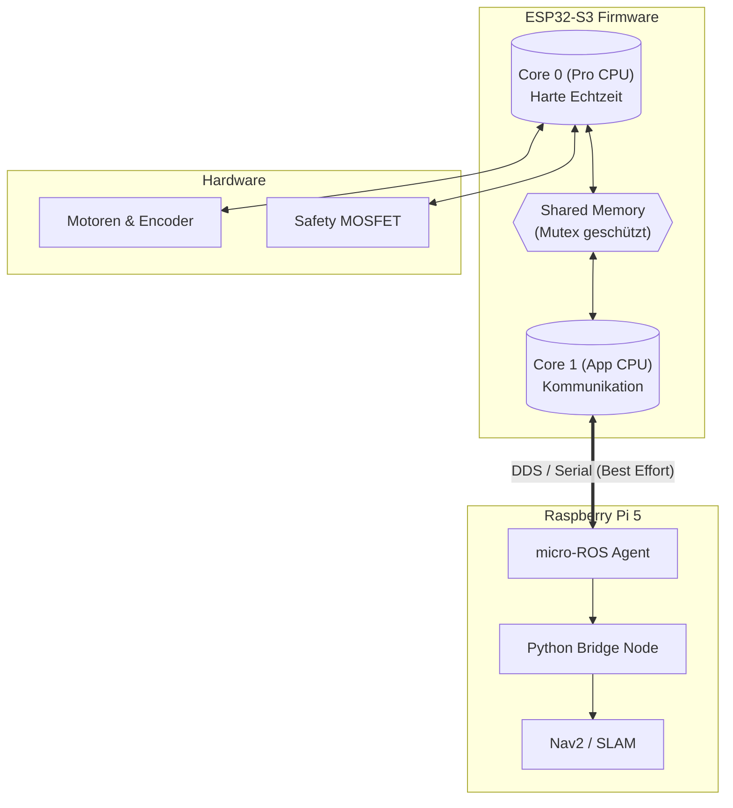

# Entwicklerdokumentation: AMR Low-Level Controller

**Version:** 3.0.0 | **Stand:** 14.12.2025 | **Status:** ✅ Phase 3 (Dual-Core & Bridge)

## 1\. Architektur-Design

Das System folgt einer **Hybrid-Echtzeit-Architektur**. Um die Bandbreiten-Probleme früherer Versionen (Serial Saturation) zu lösen, trennen wir physikalische Regelung strikt von der Datenkommunikation.

### 1.1 Dual-Core Aufteilung (ESP32-S3)

Der ESP32-S3 verfügt über zwei Kerne. Wir nutzen **FreeRTOS**, um Aufgaben basierend auf ihrer Zeitkritikalität zuzuweisen.



-----

## 2\. Hardware Abstraction Layer (HAL)

Die Pin-Belegung wurde für die **komplette Hardware-Nutzung** refaktoriert. Alle Pins sind initialisiert, um Floating-States zu vermeiden.

| Ressource | Pin | Core-Zuständigkeit | Funktion | Status |
| :--- | :--- | :--- | :--- | :--- |
| **Motor L/R** | D0-D3 | **Core 0** | PWM-Erzeugung (20 kHz, Silent) | ✅ Aktiv |
| **Encoder L/R** | D6, D7 | **Core 0** | ISR (Rising Edge) & Tick-Count | ✅ Aktiv |
| **Safety** | D10 | **Core 0** | MOSFET (Not-Aus / LED) | ✅ Aktiv |
| **I2C Bus** | D4, D5 | *Core 1* | IMU (MPU6050) Datenbus | ⏳ Reserviert |
| **Servo 1** | D8 | *Core 1* | Kamera Pan (PWM) | ⏳ Reserviert |
| **Servo 2** | D9 | *Core 1* | Kamera Tilt (PWM) | ⏳ Reserviert |

> **Hinweis:** I2C und Servos liegen auf Core 1, da `Wire.read()` blockierend wirken kann und Servos (50Hz) keine harte Echtzeit benötigen. Dies schützt den PID-Regler auf Core 0.

-----

## 3\. Firmware-Logik (`main.cpp`)

Die Firmware basiert auf zwei parallelen Tasks.

### 3.1 Task: `controlTask` (Core 0)

Dies ist das „Rückenmark“ des Roboters.

* **Frequenz:** 100 Hz (fixiert durch `vTaskDelayUntil`).
* **Logik:**
    1. **Atomic Read:** Encoder-Werte auslesen.
    2. **Math:** Odometrie berechnen ($x, y, \theta$).
    3. **PID:** Stellgrößen berechnen.
    4. **Safety:** Prüfen, ob `last_cmd_time > 1000ms`. Falls ja: Motoren aus.

### 3.2 Task: `loop` (Core 1)

Dies ist das „Sprachzentrum“.

* **Frequenz:** Best Effort (so schnell wie möglich).
* **Logik:**
    1. `rclc_executor_spin`: Prüft auf neue `/cmd_vel` Pakete.
    2. `publish_odometry`: Sendet alle 50ms die Position.
    3. **Sync:** Greift nur via `xSemaphoreTake` auf Daten zu.

-----

## 4\. Schnittstellen & Datenfluss

Um die serielle Bandbreite zu schonen, wurde das Protokoll optimiert.

### 4.1 Raw-Interface (ESP32 ↔ Agent)

| Topic | Typ | QoS | Frequenz | Inhalt |
| :--- | :--- | :--- | :--- | :--- |
| `/odom_raw` | `geometry_msgs/Pose2D` | **Best Effort** | 20 Hz | Nur $x, y, \theta$ (Spart \~60% Overhead) |
| `/cmd_vel` | `geometry_msgs/Twist` | Reliable | Variabel | Soll-Geschwindigkeit |
| `/heartbeat` | `std_msgs/Int32` | Best Effort | 1 Hz | Diagnose-Zähler |

### 4.2 Bridge-Interface (Agent ↔ Nav2)

Der **Python Bridge-Node** (`odom_converter.py`) auf dem Raspberry Pi normalisiert die Daten für ROS-Standards (REP-105).

1. **Input:** Nimmt `/odom_raw` (Pose2D).
2. **Berechnung:**
      * Konvertiert Euler-Winkel ($\theta$) in Quaternionen ($x,y,z,w$).
      * Berechnet Geschwindigkeiten ($v_x, v_{theta}$) durch Differenzierung.
3. **Output:**
      * Publiziert `/odom` (`nav_msgs/Odometry`) mit Kovarianz-Matrizen.
      * Sendet `/tf` Transform (`odom` → `base_link`).

-----

## 5\. Deployment & Testing

### 5.1 Firmware Update

```bash
# Im Verzeichnis firmware/
pio run -t clean
pio run -t upload
```

*Nach dem Upload blinkt die LED, bis der Agent verbunden ist.*

### 5.2 Host-System Start

```bash
# 1. Agent starten (falls nicht autostart)
sudo systemctl start microros-agent

# 2. Bridge-Node starten
ros2 run amr_pkg odom_converter.py
```

### 5.3 Validierung

1. **Verbindung prüfen:**

    ```bash
    ros2 topic list
    # Muss /odom_raw UND /odom anzeigen
    ```

2. **Rohdaten prüfen:**

    ```bash
    ros2 topic echo /odom_raw
    # Bewege Roboter -> x/y müssen sich ändern
    ```

3. **TF-Baum prüfen (Wichtig für SLAM):**

    ```bash
    ros2 run tf2_tools view_frames
    # Muss Verbindung map -> odom -> base_link zeigen
    ```

-----

## 6\. Risiken & Lösungen

| Problem | Ursache | Lösung |
| :--- | :--- | :--- |
| **Motor stottert** | QoS Mismatch | Sicherstellen, dass Bridge-Node `Best Effort` nutzt. |
| **Drift** | Schlupf / PID | PID-Tuning in `config.h` anpassen (`Ki` erhöhen). |
| **Kein TF** | Bridge läuft nicht | `odom_converter.py` prüfen. |

-----

*Diese Dokumentation ersetzt alle vorherigen Fragmente und dient als "Single Source of Truth" für Phase 3.*
