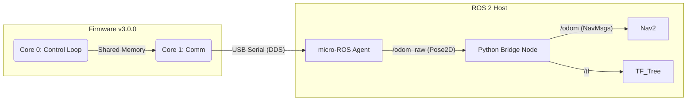

# Systemdokumentation: AMR Low-Level Controller

**Version:** 3.0.0 | **Datum:** 14.12.2025 | **Status:** ✅ Phase 3 (micro-ROS Dual-Core)

## 1\. Architektur-Übersicht

Das System implementiert eine **Hybrid-Echtzeit-Architektur**. Um die Latenz-Probleme der Version 2.x zu beheben, werden harte Echtzeit-Anforderungen (Motorregelung) strikt von Kommunikations-Aufgaben (micro-ROS) getrennt.

### 1.1 Datenfluss-Diagramm



-----

## 2\. Firmware-Architektur (Dual-Core)

Die Firmware nutzt das **FreeRTOS** Betriebssystem des ESP32, um zwei parallele Tasks auf den physischen CPU-Kernen auszuführen.

### 2.1 Core 0: Das "Rückenmark" (Hard Real-Time)

* **Task Name:** `controlTask`
* **Frequenz:** 100 Hz (Deterministisch via `vTaskDelayUntil`)
* **Aufgaben:**
    1. Encoder-Interrupts auslesen (Atomar).
    2. Odometrie integrieren ($x, y, \theta$).
    3. **PID-Regelung** berechnen.
    4. **Safety-Check:** Heartbeat-Timeout (1000ms) prüfen → Not-Halt.
* **Priorität:** Hoch (`configMAX_PRIORITIES - 1`).

### 2.2 Core 1: Das "Gehirn" (Communication)

* **Task:** `loop()` (Arduino Standard)
* **Aufgaben:**
    1. micro-ROS Executor Spin (Datenempfang/Versand).
    2. Serialisierung der DDS-Nachrichten.
    3. I2C-Kommunikation (Zukunft: IMU).
* **Datenaustausch:** Über `SharedData` Struct, geschützt durch **Mutex** (Semaphore).

-----

## 3\. ROS 2 Schnittstelle (API)

Durch die Bandbreiten-Optimierung hat sich die Schnittstelle geändert. Der ESP32 sendet keine Einzelwerte mehr, sondern aggregierte Pakete.

### 3.1 Topics (Raw Layer - ESP32)

| Topic | Typ | Frequenz | QoS | Beschreibung |
|-------|-----|----------|-----|--------------|
| `/odom_raw` | `geometry_msgs/Pose2D` | 20 Hz | Best Effort | **Neu:** Leichtgewichtige Pose (x, y, theta) |
| `/esp32/heartbeat` | `std_msgs/Int32` | 1 Hz | Best Effort | Watchdog-Zähler |
| `/cmd_vel` | `geometry_msgs/Twist` | - | Reliable | Steuerbefehle |
| `/esp32/led_cmd` | `std_msgs/Bool` | - | Reliable | Status-LED / MOSFET |

### 3.2 Topics (Application Layer - Host/Bridge)

Der `odom_converter.py` Node auf dem Raspberry Pi generiert daraus die Standard-Topics für Navigation:

| Topic | Typ | Beschreibung |
|-------|-----|--------------|
| `/odom` | `nav_msgs/Odometry` | Standard-Odometrie mit Kovarianzen & Twist |
| `/tf` | `tf2_msgs/TFMessage` | Transformation `odom` → `base_link` |

-----

## 4\. Konfiguration & Parameter (`config.h`)

### 4.1 Timing & Bandbreite

Um "Serial Saturation" (Verstopfung der USB-Leitung) zu verhindern, wurden die Raten angepasst:

| Parameter | Wert | Grund |
|-----------|------|-------|
| `LOOP_RATE_HZ` | 100 Hz | Benötigt für stabile PID-Regelung |
| `ODOM_PUBLISH_HZ` | **20 Hz** | Reduziert von 50Hz; ausreichend für AMCL |
| `FAILSAFE_TIMEOUT` | **1000 ms** | Erhöht von 500ms; Toleranz für WLAN/DDS Jitter |

### 4.2 Hardware Abstraction (HAL)

| Pin | Funktion | Modus | Hardware |
|-----|----------|-------|----------|
| D0-D3 | Motoren | PWM (20 kHz) | Cytron MDD3A |
| D6, D7 | Encoder | ISR (Rising) | JGA25 Motoren |
| D10 | Safety | Digital Out | MOSFET (IRLZ24N) |
| D4, D5 | I2C | Wire | *Reserviert (MPU6050)* |
| D8, D9 | Servo | PWM | *Reserviert (Kamera)* |

-----

## 5\. Inbetriebnahme (Operator Manual)

### 5.1 Start-Reihenfolge

1. **Hardware:** Roboter einschalten (12V). ESP32 bootet (LED blinkt = Suche Agent).
2. **Agent:** Raspberry Pi startet `microros-agent` service automatisch.
      * *Check:* ESP32 LED leuchtet dauerhaft = Verbunden.
3. **Bridge:** Starten des Konverters (manuell oder via Launchfile):

    ```bash
    ros2 run amr_pkg odom_converter
    ```

### 5.2 Verifikation

**Schritt 1: Rohdaten prüfen (Kommt was vom ESP32?)**

```bash
ros2 topic echo /odom_raw
# Erwartet: x, y, theta Werte ändern sich beim Schieben
```

**Schritt 2: Transformation prüfen (Läuft der Bridge-Node?)**

```bash
ros2 topic echo /odom
# Erwartet: Volle Odometrie-Nachricht mit Quaternionen
```

**Schritt 3: Fahren**

```bash
ros2 topic pub /cmd_vel geometry_msgs/msg/Twist "{linear: {x: 0.2}, angular: {z: 0.0}}" -r 10
```

-----

## 6\. Known Issues & Lösungen

| Symptom | Ursache | Lösung |
|---------|---------|--------|
| **Roboter "ruckelt"** | Failsafe greift ein (Timeout) | `FAILSAFE_TIMEOUT_MS` in `config.h` erhöhen oder Agent-Priorität prüfen. |
| **Keine Odom-Daten** | QoS Mismatch | Bridge-Node muss `Best Effort` QoS nutzen (siehe `odom_converter.py`). |
| **Drift** | PID-Werte unpassend | Kalibrierung wiederholen; Bodenbeschaffenheit prüfen. |

-----

## 7\. Changelog

### v3.0.0 (14.12.2025) - Major Release

* **Architektur:** Wechsel auf Dual-Core (App/Pro CPU Trennung).
* **RTOS:** Einführung von FreeRTOS Tasks und Mutex-Synchronisation.
* **Daten:** Optimierung auf `Pose2D` (Bandbreitenersparnis \~60%).
* **Host:** Einführung `odom_converter.py` für REP-105 Konformität.
* **Hardware:** Vollständige Initialisierung aller Pins (I2C/Servo Vorbereitung).

### v2.2.2 (13.12.2025) - Legacy

* Single-Loop Architektur.
* 3 separate Float-Topics (veraltet).

-----

## 8\. Projektstruktur (Aktualisiert)

```
amr-platform/
├── firmware/                 # ◄── v3.0.0 (Dual-Core)
│   ├── src/main.cpp          # FreeRTOS + micro-ROS
│   └── include/config.h      # 20Hz Config
├── ros2_ws/
│   └── src/amr_pkg/
│       └── scripts/
│           └── odom_converter.py # ◄── NEU: Bridge Node
└── docs/
    └── systemdokumentation.md
```
